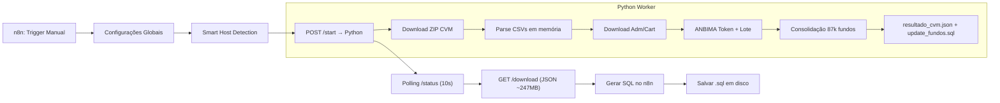
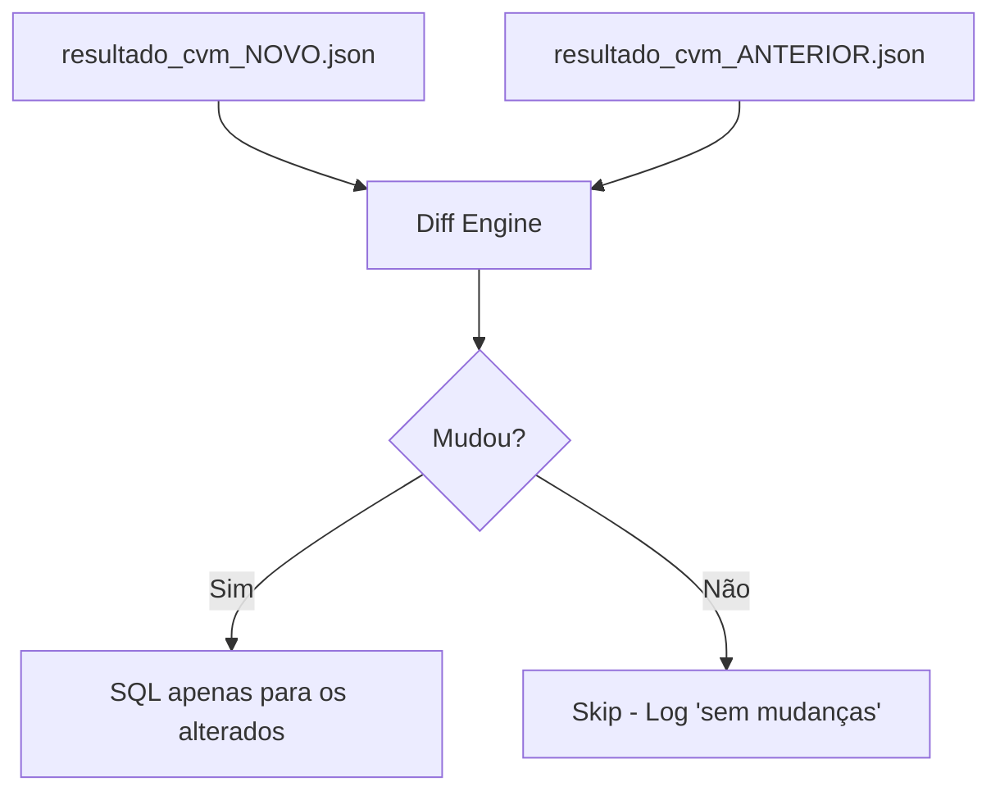
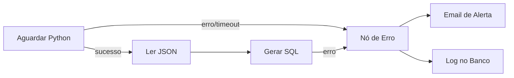
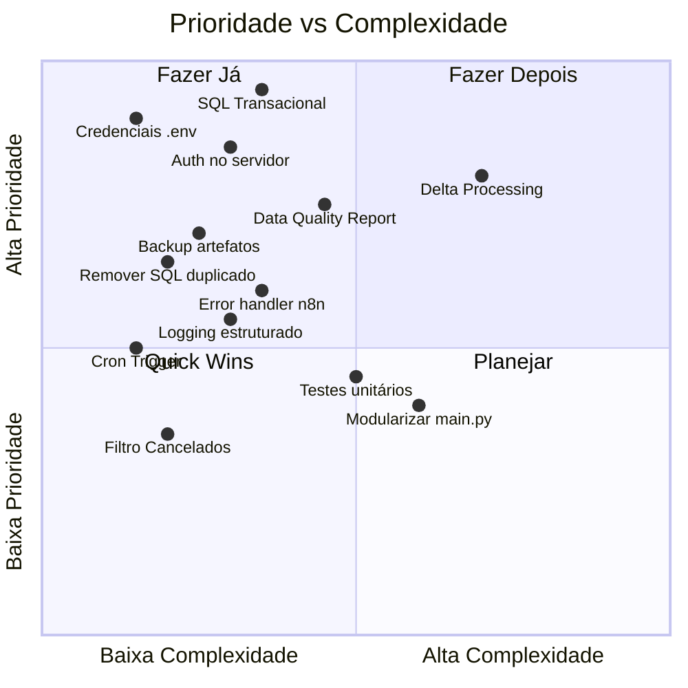

# 🔍 Análise Completa: Pipeline de Automação B3 — Próximos Passos

## Visão Geral do Fluxo Atual



**Números atuais:** 87.134 fundos → JSON de 247 MB → SQL de 151 MB

---

## 1. 🔄 Transações e Rollback (SQL)

> [!CAUTION]
> **Risco Crítico:** O SQL gerado atualmente é uma sequência linear de ~87.000 chamadas de procedure SEM controle transacional. Se a execução falhar no meio, o banco fica em estado inconsistente (metade dos fundos atualizados, metade não).

### Estado Atual
```sql
-- Arquivo gerado atualmente (update_fundos.sql):
CETIP.P_ATUALIZA_RAZAO_SOCIAL('00016999000167','OPERINVEST III FMIA');
CETIP.P_ATUALIZA_ADMINISTRADOR('00016999000167','12345678000100','ADMIN NOME');
-- ... 500.000+ linhas sem BEGIN/COMMIT/ROLLBACK
```

### Recomendação: SQL Transacional com Savepoints

```sql
-- Modelo recomendado:
SET SERVEROUTPUT ON;
DECLARE
  v_erros NUMBER := 0;
  v_total NUMBER := 0;
BEGIN
  -- Cabeçalho de auditoria
  INSERT INTO CETIP.LOG_ATUALIZACAO_FUNDOS 
    (dt_execucao, fonte, total_registros, status)
  VALUES (SYSDATE, 'AUTOMACAO_B3_V4', 87134, 'INICIADO');
  COMMIT;

  SAVEPOINT sp_fundo_00016999000167;
  BEGIN
    CETIP.P_ATUALIZA_RAZAO_SOCIAL('00016999000167','OPERINVEST III FMIA');
    CETIP.P_ATUALIZA_NATUREZA_ECONOMICA('00016999000167','FUNDO DE INVESTIMENTO EM ACOES');
    v_total := v_total + 1;
  EXCEPTION
    WHEN OTHERS THEN
      ROLLBACK TO sp_fundo_00016999000167;
      v_erros := v_erros + 1;
      INSERT INTO CETIP.LOG_ERROS_ATUALIZACAO 
        (cnpj_fundo, procedure_name, erro_msg, dt_erro)
      VALUES ('00016999000167', 'BATCH', SQLERRM, SYSDATE);
  END;

  -- ... próximo fundo ...
  
  -- Commit final apenas se taxa de erro < threshold
  IF v_erros < (v_total * 0.05) THEN
    COMMIT;
  ELSE
    ROLLBACK;
    RAISE_APPLICATION_ERROR(-20001, 
      'Taxa de erro acima de 5%: ' || v_erros || '/' || v_total);
  END IF;
END;
/
```

### O que implementar no `main.py`:
| Ação | Prioridade | Complexidade |
|------|-----------|-------------|
| Envolver cada CNPJ em `SAVEPOINT` / `EXCEPTION` | 🔴 Alta | Média |
| Adicionar `COMMIT` condicional no final (threshold de erro) | 🔴 Alta | Baixa |
| Gerar tabela de log de auditoria (`LOG_ATUALIZACAO_FUNDOS`) | 🟡 Média | Baixa |
| Gerar bloco `ROLLBACK` completo caso erro > 5% | 🔴 Alta | Baixa |

---

## 2. 🔑 Idempotência e Delta Processing

> [!IMPORTANT]
> Atualmente, cada execução processa **todos** os 87.134 fundos, mesmo que apenas 50 tenham mudado desde a última execução. Isso é ineficiente e perigoso.

### Recomendação: Sistema de Delta (Diff)



**Implementação prática:**
1. **Antes de sobrescrever** `resultado_cvm.json`, renomear o atual para `resultado_cvm_YYYY-MM-DD_HH-MM.json`
2. Comparar campo a campo (por CNPJ) entre a execução anterior e a nova
3. Gerar SQL **apenas para os registros que mudaram**
4. Manter um manifest (`last_run.json`) com hash SHA-256 e timestamp

**Benefícios:**
- SQL de 151 MB → ~2-5 MB por execução incremental
- Execução DB muito mais rápida
- Rollback mais seguro (afeta menos registros)
- Auditoria perfeita: sabe-se exatamente o que mudou e quando

---

## 3. 🛡️ Validação de Dados e Data Quality

> [!WARNING]
> O pipeline não valida a qualidade dos dados antes de gerar SQL. CNPJs malformados, naturezas econômicas vazias e campos faltantes são propagados diretamente para procedures da B3.

### Validações a implementar no `consolidate_fund()`:

| Validação | Campo | Regra |
|-----------|-------|-------|
| CNPJ válido (dígitos verificadores) | `cnpj_fundo`, `administrador_id`, etc. | Algoritmo módulo 11 |
| CNPJ 14 dígitos | Todos os CNPJs | `len(cnpj) == 14` |
| Natureza econômica não-vazia | `natureza_economica_final` | Rejeitar se vazio (gap) |
| Data em formato ISO | `data_registro`, `data_constituicao` | Regex `YYYY-MM-DD` |
| Tamanho razão social | `razao_social_final` | `3 <= len <= 300` |
| SQL Injection básico | Todos os campos textuais | Detectar `'; DROP`, `--`, `;` |
| Encoding limpo | Todos os campos | Sem caracteres de controle |

### Gerar relatório de qualidade:
```json
{
  "data_quality_report": {
    "total_registros": 87134,
    "validos_para_sql": 72456,
    "rejeitados": 14678,
    "motivos_rejeicao": {
      "cnpj_invalido": 23,
      "natureza_economica_vazia": 12340,
      "situacao_cancelado": 2315
    }
  }
}
```

### Filtro `situacao_cvm`:
> [!TIP]
> Dos 87.134 fundos, uma porção significativa tem `"situacao_final": "Cancelado"`. Considere **não gerar SQL** para fundos cancelados há mais de X anos, a menos que a B3 exija atualização retroativa.

---

## 4. 🔒 Segurança

### 4.1 Credenciais expostas

> [!CAUTION]
> As credenciais da ANBIMA estão **hardcoded** no workflow n8n:
> ```json
> "anbima_client_id": "lFzaX80V5YmN",
> "anbima_client_secret": "y4pPIlkqeg2b"
> ```
> Isto é um risco sério, especialmente se o `.n8n` for commitado em repositório.

**Recomendação:**
- Mover para **n8n Credentials** (tipo "Custom Auth") ou variáveis de ambiente
- No Python, usar `.env` com `python-dotenv` (já existe `.env.example` no projeto)
- Nunca commitar credenciais — adicionar ao `.gitignore`

### 4.2 HTTP Server sem autenticação

O servidor Python (`SimpleWorkerHandler`) **não tem nenhuma autenticação**. Qualquer pessoa na rede pode:
- `POST /start` → Disparar processamento pesado (DoS)
- `GET /download` → Baixar 247 MB de dados cadastrais
- `GET /stop` → **Matar o servidor remotamente**

**Recomendação:**
- Adicionar **API Key via header** (`X-API-Key`) verificada em cada request
- Limitar bind a `127.0.0.1` quando não necessário acesso remoto
- Remover ou proteger o endpoint `/stop` em produção
- Rate limiting básico (1 request `/start` por vez já existe, mas `/download` não)

### 4.3 SQL Injection

A função `esc_sql()` faz apenas escape de aspas simples:
```python
def esc_sql(s):
    return str(s or "").replace("'", "''")
```

Embora chamadas de procedure PL/SQL sejam mais seguras que queries dinâmicas, considere:
- Validar tamanho máximo de strings (para evitar overflow na procedure)
- Sanitizar caracteres de controle (`\x00`, `\n`, `\r`)
- Verificar se o valor não contém sequências perigosas como `CHR(10)`, `EXECUTE IMMEDIATE`

---

## 5. 📊 Observabilidade e Logging

### Estado Atual
- Apenas `logging.INFO` no console
- `global_job_status` básico (status/message/progress/total)
- Sem persistência de logs históricos
- Sem métricas de execução

### Recomendação: Logging Estruturado + Métricas

```python
# Modelo de log estruturado por execução:
execution_log = {
    "execution_id": "uuid-v4",
    "started_at": "2026-05-12T14:00:00-03:00",
    "finished_at": "2026-05-12T14:05:32-03:00",
    "duration_seconds": 332,
    "sources": {
        "cvm_zip": {"status": "OK", "records": 87134, "download_ms": 12340},
        "adm_cart": {"status": "OK", "records": 4521, "download_ms": 3200},
        "anbima":   {"status": "ERROR", "error": "401 Unauthorized", "records": 0}
    },
    "output": {
        "json_path": "resultado_cvm.json",
        "json_size_mb": 247,
        "sql_path": "update_fundos.sql",
        "sql_lines": 523456,
        "sql_size_mb": 151
    },
    "data_quality": {
        "total_fundos": 87134,
        "com_gaps": 14678,
        "sem_natureza_economica": 12340,
        "sem_administrador": 890
    },
    "delta": {
        "novos": 45,
        "alterados": 123,
        "removidos": 2,
        "inalterados": 86964
    }
}
```

**Ações:**
| Ação | Prioridade | Complexidade |
|------|-----------|-------------|
| Salvar log JSON por execução (`logs/exec_YYYY-MM-DD.json`) | 🟡 Média | Baixa |
| Adicionar timing para cada etapa (download, parse, consolidação) | 🟡 Média | Baixa |
| Expor endpoint `/logs` ou `/last-run` no servidor | 🟢 Baixa | Baixa |
| Relatório de data quality embutido no JSON | 🔴 Alta | Média |

---

## 6. 🏗️ Infraestrutura e Docker

### 6.1 Backup automático dos artefatos

O pipeline atualmente **sobrescreve** `resultado_cvm.json` e `update_fundos.sql` a cada execução sem manter histórico.

**Recomendação:**
```
data/
├── current/
│   ├── resultado_cvm.json          # link simbólico para o mais recente
│   └── update_fundos.sql
├── archive/
│   ├── 2026-05-12_14-00/
│   │   ├── resultado_cvm.json
│   │   ├── update_fundos.sql
│   │   └── execution_log.json
│   ├── 2026-05-11_14-00/
│   └── ...
└── logs/
    └── executions.jsonl            # append-only log
```

### 6.2 Docker Compose: Health + Restart

O `docker-compose.yml` está bom mas falta:

```yaml
services:
  b3-worker:
    # ... existente ...
    deploy:
      resources:
        limits:
          memory: 2G        # O JSON de 247MB em memória exige pelo menos ~1.5GB
        reservations:
          memory: 512M
    logging:
      driver: json-file
      options:
        max-size: "10m"
        max-file: "3"
```

### 6.3 Volume de dados: `resultado_cvm.json` tem 247 MB

> [!WARNING]
> O n8n faz `GET /download` para transferir **247 MB de JSON** via HTTP e depois processa tudo no JavaScript do nó "Gerar Consultas SQL". Isso pode causar timeout ou crash de memória no n8n.

**Recomendação:** O Python **já gera o SQL localmente** (linhas 715-814 do main.py). A geração duplicada no n8n é **redundante**. Considere:
1. Eliminar a transferência do JSON inteiro para o n8n
2. Adicionar endpoint `/download-sql` no Python para baixar direto o `.sql`
3. O nó n8n passa a apenas baixar e salvar o SQL pronto

---

## 7. 🔧 Melhorias no Workflow n8n

### 7.1 Tratamento de erro

O workflow não tem **nenhum nó de erro** ou notificação. Se o Python falhar:
- O polling para depois de 2 horas (silenciosamente)
- Ninguém é notificado
- Sem retry automático no n8n

**Recomendação:**


### 7.2 Schedule Trigger

O trigger é manual. Para produção, adicionar:
- **Cron Trigger** (ex: diariamente às 6h)
- **Webhook Trigger** (para disparo sob demanda com autenticação)
- Manter o manual como fallback

### 7.3 Procedures duplicadas n8n vs Python

O n8n gera SQL **com apenas 9 procedures** (nó "Gerar Consultas SQL"):
```
razaoSocial, administrador, gestor, escriturador, 
naturezaEconomica, naturezaJuridica, tipoFundo,
denominacaoSocialFundo, denominacaoSocialClasse
```

O Python gera SQL com **25 procedures** (incluindo endereços, telefones, emails, datas, custodiante, etc.):
```
+ custodiante, diretorResponsavel, dataConstituicao, dataRegistro,
+ dataSituacao, codigoCVM, administradorEndereco, administradorTelefones,
+ administradorEmail, gestorEndereco, gestorTelefones, gestorEmail,
+ escrituradorEndereco, escrituradorTelefones, escrituradorEmail,
+ custodianteEndereco, custodianteTelefones, custodianteEmail
```

> [!IMPORTANT]
> A divergência entre as duas gerações de SQL pode causar inconsistência. Se o SQL do Python for o definitivo (e deveria ser, por ser mais completo), **remova a geração duplicada do n8n** e use apenas o `.sql` que o Python já gera.

---

## 8. 🧹 Qualidade de Código (main.py)

| Problema | Linha(s) | Recomendação |
|----------|---------|-------------|
| Arquivo monolítico (916 linhas) | Todo | Separar em módulos: `cvm.py`, `anbima.py`, `sql_generator.py`, `server.py` |
| `global_job_status` como variável global mutável | 31 | Usar classe `JobManager` com lock thread-safe |
| `os._exit(0)` no endpoint `/stop` | 850 | Shutdown graceful com `httpd.shutdown()` |
| SQL gerado tanto no Python quanto no n8n | 715-814 / n8n | Eliminar duplicação |
| Sem testes unitários | — | Adicionar pytest para `map_natureza_economica_b3()`, `consolidate_fund()`, `esc_sql()` |
| `tenacity` importado mas não usado | 16 | Adicionar retry no download CVM/ANBIMA |
| Sem type hints completos | Vários | Adicionar type hints e validação com Pydantic |

---

## Resumo de Prioridades



---

## Ordem de Execução Recomendada

### 🔴 Fase 1 — Segurança e Integridade (Urgente)
1. Mover credenciais ANBIMA para variáveis de ambiente
2. Adicionar autenticação (API Key) ao servidor HTTP
3. Proteger/remover endpoint `/stop`
4. SQL transacional com SAVEPOINT + COMMIT condicional

### 🟡 Fase 2 — Robustez e Eficiência
5. Eliminar geração SQL duplicada (usar apenas Python)
6. Backup automático dos artefatos antes de sobrescrever
7. Validação de CNPJs e data quality report
8. Logging estruturado com histórico por execução

### 🟢 Fase 3 — Produção e Escala
9. Delta processing (só atualizar o que mudou)
10. Tratamento de erros + notificação no n8n
11. Schedule trigger (Cron)
12. Modularizar `main.py` em pacote Python

### 🔵 Fase 4 — Excelência
13. Testes unitários (pytest)
14. Filtro inteligente por situação (Cancelado, Em funcionamento)
15. Rate limiting e limits de memória no Docker
16. Dashboard de monitoramento (Grafana ou n8n sub-workflow)
